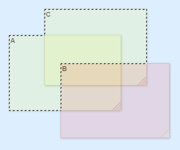

# Region2D Library

Copyright © 2017 by Sean Werkema

Licensed under the [Apache 2.0 Open Source License](LICENSE.txt).





## Overview

This is a JavaScript implementation of the Region abstract data type, which 2-D graphics systems use to perform constructive solid geometry.


**WARNING: CURRENT STATUS: BETA.**  Many operations work (see the demo!) but some operations are untested, and some don't work at all yet.  Unit test coverage is at ~90% for `Region1d`, but only about 50% for `Region2d`.  Use at your own risk.


### Features

Notable features of this implementation include:

- Set-theoretic operations:  Union, Intersect, Subtract, Exclusive-or, Logical Not
- Intersection tests, both for other regions and for points
- Equality tests, and efficient hash-code generation for dictionary/map keys
- Conversion to and from sets of rectangles
- Conversion to a path (set of polygons)
- Transformations:  Translate and Scale
- Infinite and empty regions
- Unit test coverage
- Data structures that are both opaque and immutable (i.e., _safe_)


## Installation

**Vanilla JavaScript in the Browser:**

- Download a copy of [region.js](umd/region.js) or [region.min.js](umd/region.min.js)  This UMD bundle includes both Region types.
- Include `<script src="region.js"></script>` in your page.  This will introduce two new global types, `Region1D` and `Region2D`.

**For NodeJS and NPM:**

In NodeJS or a CommonJS environment, install the `region2d` package, and then use `import` or `require` to pull in the new types:

- `import Region2D from "region2d";`  (ES6)
    or
- `import { Region1D, Region2D } from "region2d";`  (ES6)
    or
- `var Region2D = require('region2d');`  (in classic JavaScript)


## Region2D usage

A `Region2D` is an opaque object that represents a set of points in the 2-D plane, and is always composed of a series of nonoverlapping axis-aligned rectangles.

**Construction:**

```
var myRegion = new Region2D([x, y, width, height]);
var myRegion = new Region2D({ x:, y:, width:, height: });
var myRegion = new Region2D({ left:, top:, right:, bottom: });
var myRegion = new Region2D(htmlElement);
```

There are several ways to construct a `Region2D` instance, as depicted above:

- You can create a `Region2D` from an array containing a set of exactly four numbers, which will be interpreted as the rectangle's leftmost `x`, topmost `y`, its `width`, and its `height`, in that order.
- You can create a `Region2D` from any object with numeric `x`, `y`, `width`, and `height` properties.
- You can create a `Region2D` from any object with numeric `left`, `top`, `right`, and `bottom` properties.
- And, in browser environments, you can pass in an `HTMLElement` instance (a DOM element) to construct a region from its bounding box (page-relative).

However the rectangle is represented, `Region2D` always follows the following rules, both for rectangles used as input to it and for those that it produces as output:

- `x = left`
- `y = top`
- `width = right - left` 
- `height = bottom - top`

`Region2D` is designed to be reasonably efficient:  All methods on `Region2D` run in O(n) time, except for the binary operations (which run in O(n+m) time), and for a few operations that are O(1) or O(lg n), as noted below.

Region2D includes many operations for manipulating its set of points:

**Set-theoretic operations:**

```
var newRegion = myRegion.union(yourRegion);
var newRegion = myRegion.intersect(yourRegion);
var newRegion = myRegion.xor(yourRegion);
var newRegion = myRegion.subtract(yourRegion);
var newRegion = myRegion.not();
```

**Transformation operations:**

```
var newRegion = myRegion.transform(scaleX, scaleY, offsetX, offsetY);
var newRegion = myRegion.translate(offsetX, offsetY);
var newRegion = myRegion.scale(scaleX, scaleY);
```

**Testing and comparison:**

```
var bool = myRegion.isEmpty();                  // O(1)
var bool = myRegion.isInfinite();               // O(1). True if any rect reaches +inf or -inf.
var bool = myRegion.isFinite();                 // O(1). Opposite of isInfinite().
var bool = myRegion.isRectangular();            // O(1). True if region is exactly one rect.
var bool = myRegion.doesIntersect(yourRegion);  // O(n+m)
var bool = myRegion.isPointIn(x);               // O(lg n)
var bool = myRegion.equals(yourRegion);         // O(n)
```

**Data extraction:**

```
var numberOfRects = myRegion.getCount();        // O(1)
var arrayOfRects = myRegion.getRects();         // Returns a copy, not the original rects.
var rect = myRegion.getBounds();                // O(1)
var arrayOfPolygons = myRegion.getPath();       // Array of arrays of {x:,y:} points.
var hashCode = myRegion.getHashCode();          // O(1)
```

**Static instances:**

```
var nothing = Region2d.empty;
var everything = Region2d.infinite;
```


## Region1D usage

This library also includes an implementation of `Region1D`, which is used internally by `Region2D` but can be useful in its own right.  A `Region1D` is an opaque object that represents a set of points on the number line, and is always composed of a series of nonoverlapping nonadjacent [start,end) pairs.

**Construction:**

```
var myRegion = new Region1D([span1Min, span1Max, span2Min, span2Max, span3Min, span3Max, ...]);
```

1-D regions are composed of spans of included content.  Span endpoints are of the form [min, max).  The minima and maxima of a span may include either positive or negative infinity.  Spans must not overlap or adjoin, and must appear in strictly ascending order.  All 1-D regions are immutable once constructed.

There is also a global `Region1D.empty` static instance available, which consists of no spans.

`Region1D` is designed to be reasonably efficient:  All `Region1D` operations run in O(n) time, except for the binary operations (which run in O(n+m) time), and for a few operations that are O(1) or O(lg n), as noted below.

Region1D includes many operations for manipulating its set of points:

**Set-theoretic operations:**

```
var newRegion = myRegion.union(yourRegion);
var newRegion = myRegion.intersect(yourRegion);
var newRegion = myRegion.xor(yourRegion);
var newRegion = myRegion.subtract(yourRegion);
var newRegion = myRegion.not();
```

**Transformation operations:**

```
var newRegion = myRegion.transform(scale, offset);
var newRegion = myRegion.translate(offset);
var newRegion = myRegion.scale(scale);
```

**Testing and comparison:**

```
var bool = myRegion.isEmpty();                  // O(1)
var bool = myRegion.isPointIn(x);               // O(lg n)
var bool = myRegion.doesIntersect(yourRegion);  // O(n+m)
var bool = myRegion.equals(yourRegion);         // O(n)
```

**Data extraction:**

```
var numberOfSpans = myRegion.getCount();        // O(1)
var arrayOfRects = myRegion.getAsRects(minY, maxY);
var arrayOfSpans = myRegion.getRawSpans();      // Returns a copy, not the original spans.
var minAndMax = myRegion.getBounds();           // O(1)
var hashCode = myRegion.getHashCode();          // O(1)
```

**Static instances:**

```
var nothing = Region1d.empty;
```


## Implementation Details

### Overview

This implementation uses the _banded rectangles_ technique, which is used in many implementations of X Windows, and which was chosen for its speed.

Each `Region2d` is conceptually represented as a set of nonoverlapping rectangles, where no rectangle may have a minimum or maximum Y coordinate between any other rectangle's minimum or maximum Y coordinate.  Thus the rectangles effectively form horizontal _bands_, where all of the rectangles in a given band have the same minimum and maximum Y coordinate.  In `Region2d`, each band is implemented as a simple object of the form  `{ region:, minY:, maxY: }`, where the `region` property represents the rectangles but is actually a `Region1D` object.  The bands are stored in an array, and are always in strictly ascending Y-coordinate order.

While _banded rectangles_ do not always result in the fewest possible number of rectangles to represent a region, they allow set-theoretic operations to be performed very simply and quickly:  To union, intersect, subtract, or exclusive-or any two regions, you need only line up those regions' bands where they overlap, and apply `Region1d` operations on each pair of bands to produce the result.  (There are considerable details to make that work reliably and efficiently, but that is the basic idea.)

It also comes with the nice side effect that a readout of all rectangles in the region will always have coordinates that read top-to-bottom, left-to-right, which can be useful for some applications.

### Invariants

Certain invariants are always maintained for a `Region2d`'s bands:

- Bands are always in sorted order of ascending Y coordinate.
- No band may ever be empty (_i.e., empty bands must be discarded_).
- No band may have a minimum Y or maximum Y between the minimum Y and maximum Y of another band (_i.e., bands may not overlap_).
- Two successive bands may not have identical rectangles if the minimum Y of one band matches the maximum Y of another (_i.e., identical bands must be coalesced_).

Within each band, since its rectangles are implemented as a `Region1d`, the `Region1d` invariants also hold for the band's rectangles:

- Rectangles must be in strictly sorted order of ascending X coordinates.
- No rectangle's maximum X may be greater than or equal to the minimum X of its successor (_i.e., rectangles must not be directly adjacent or overlapping_).

### Performance

Using the _banded rectangles_ design ensures that:

- All binary operations run in a worst-case time of O(n+m).
- All unary operations run in a worst-case time of O(n).
- Some operations (such as a point-test) can run in O(lg n) time.

However, this speed does come at a cost in space, in that `Region2d` may (in a pathological case) require twice as many rectangles compared to an optimal representation of the same region.

### Prior Art

This pure-JavaScript `Region2D` is comparable in functionality to many similar data structures in other environments:

- `Region` in X Windows
- `GdkRegion` in GDK (Gnome)
- `HRGN` in Microsoft Windows
- `System.Drawing.Region` in .NET
- The region handle in classic Mac OS (Carbon) programming.

This implementation is missing some features common to other implementations:

- Creation of a region from a polygon, from a Bézier curve, or from an arbitrary clipping path
- Non-axis-aligned region boundaries
- Direct (efficient) intersection/containment testing of a rectangle against a region
- Direct (efficient) unioning of a rectangle to a region
- Direct (efficient) creation of a region from a set of many rectangles


## License

This library is licensed under the [Apache 2.0](LICENSE.txt) open-source license, which basically means:

- It's free, and you can -
- Do what you want with it, but -
- Don't claim you wrote it, and -
- Don't complain if it breaks.

